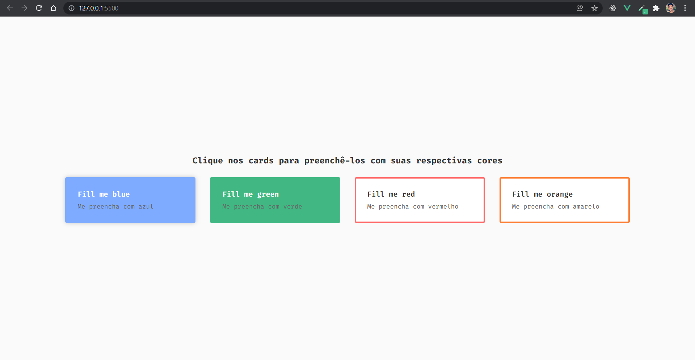

# Working with classes and styles of tags usign Vue

### Vue.js has its particular way to deal with style manipulation. We can control reactively the tags "class" and "style" binding them (v-bind:class v-bind:style | :class :style)

 
Check the screenshot below:
